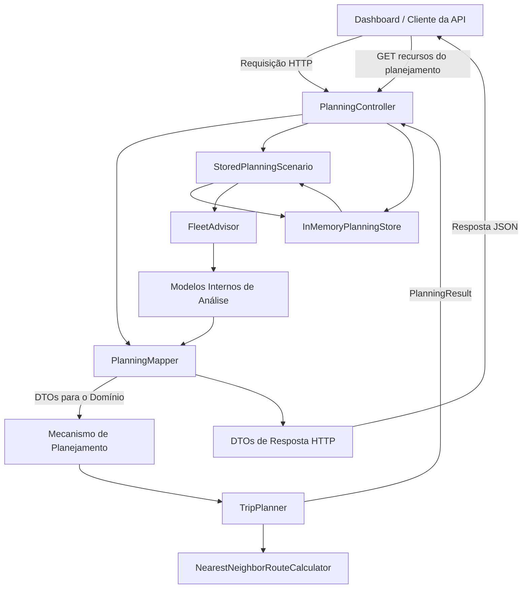
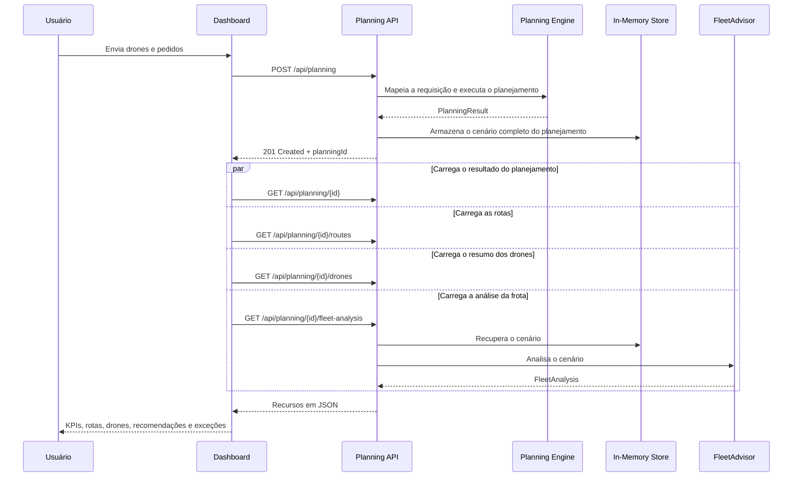

# Planejador de Entregas com Drones

[](https://dotnet.microsoft.com/)
[](https://learn.microsoft.com/aspnet/core/)
[](#testes)
[](#licença)
[](#)

🌐 **Idiomas:** 🇺🇸 [English](README.md) | 🇧🇷 [Português]

Uma aplicação full stack para planejamento de entregas com drones, desenvolvida com **ASP.NET Core 8**, composta por um mecanismo de planejamento orientado ao domínio, armazenamento de cenários em memória, análise operacional da frota, endpoints REST, testes automatizados e um dashboard responsivo implementado com HTML, CSS, JavaScript e SVG nativos.

O projeto demonstra conhecimentos práticos em desenvolvimento backend, modelagem de domínio, design de APIs, raciocínio algorítmico, decisões arquiteturais e a capacidade de transformar um teste técnico em um produto de software completo, organizado e pronto para avaliação.

---

## Sumário

- [Visão Geral](#visão-geral)
- [Principais Funcionalidades](#principais-funcionalidades)
- [Demonstração](#demonstração)
- [Arquitetura da Solução](#arquitetura-da-solução)
- [Tecnologias Utilizadas](#tecnologias-utilizadas)
- [Estrutura do Projeto](#estrutura-do-projeto)
- [Algoritmo de Planejamento](#algoritmo-de-planejamento)
- [FleetAdvisor](#fleetadvisor)
- [Fluxo da Aplicação](#fluxo-da-aplicação)
- [Endpoints da API](#endpoints-da-api)
- [Exemplos de Requisições e Respostas](#exemplos-de-requisições-e-respostas)
- [Dashboard](#dashboard)
- [Como Executar Localmente](#como-executar-localmente)
- [Testes](#testes)
- [Decisões Arquiteturais e Trade-offs](#decisões-arquiteturais-e-trade-offs)
- [Melhorias Futuras](#melhorias-futuras)
- [Licença](#licença)

---

## Visão Geral

O **Drone Delivery Planner** recebe uma frota de drones e um conjunto de pedidos de entrega, gerando um plano operacional que distribui os pedidos viáveis entre os drones e os organiza em viagens.

Cada pedido possui um identificador único, peso da carga, prioridade de entrega e coordenadas cartesianas. Cada drone possui um identificador único, capacidade máxima de carga e alcance operacional.

A aplicação avalia se cada pedido pode ser atendido, gera as viagens de entrega, calcula as distâncias percorridas, disponibiliza os resultados por meio de uma REST API, armazena o cenário de planejamento em memória e fornece análises operacionais adicionais da frota.

O dashboard consome os mesmos endpoints públicos da API e não replica nenhuma regra de negócio no navegador.

---

## Principais Funcionalidades

- Planejamento de entregas baseado na capacidade de carga e no alcance dos drones
- Processamento de pedidos considerando prioridade
- Construção de rotas utilizando o algoritmo do Vizinho Mais Próximo (Nearest Neighbor)
- Detecção de pedidos impossíveis de serem atendidos
- Armazenamento de cenários em memória
- Recuperação de planejamentos previamente criados
- Projeção das rotas com sequência de paradas e coordenadas
- Resumo operacional individual de cada drone
- Análise de participação e utilização da frota
- Cálculo do fator de carga e utilização do alcance
- Eficiência da frota em quilogramas por quilômetro
- Estimativa do tempo de voo
- Recomendações operacionais baseadas na análise da frota
- Separação clara entre modelos internos de análise e contratos HTTP
- Dashboard responsivo com visualização das rotas em SVG
- Testes automatizados de domínio e integração da API
- Documentação da API com Swagger/OpenAPI
- Sem dependência de frameworks frontend ou bibliotecas externas de gráficos

---

## Demonstração

## Dashboard


## Visualização das Rotas


## Recomendações


## Swagger


---

## Arquitetura da Solução

A solução separa claramente o modelo de domínio, a API HTTP, a camada de análise, o armazenamento em memória, o mapeamento entre modelos e os testes automatizados.



### Principais responsabilidades

| Componente | Responsabilidade |
|---|---|
| `DroneDelivery.Domain` | Entidades principais, objetos de valor, regras de planejamento, lógica de roteamento e resultados do planejamento |
| `DroneDelivery.Api` | Contratos HTTP, controllers, mapeamento, armazenamento, análises, configurações e dashboard |
| `InMemoryPlanningStore` | Armazenamento thread-safe dos cenários completos de planejamento |
| `FleetAdvisor` | Métricas operacionais e recomendações para a frota |
| `PlanningMapper` | Conversão entre contratos da API, objetos de domínio e modelos de resposta |
| `DroneDelivery.Domain.Tests` | Testes unitários do domínio |
| `DroneDelivery.Api.IntegrationTests` | Testes de integração ponta a ponta da API |

---

## Tecnologias Utilizadas

### Backend

- .NET 8
- ASP.NET Core Web API
- C#
- Swagger / OpenAPI
- `ConcurrentDictionary`
- Pattern `IOptions<T>`

### Frontend

- HTML5
- CSS3
- JavaScript nativo
- SVG
- Fetch API

### Testes

- xUnit
- `WebApplicationFactory<Program>`
- Testes de integração do ASP.NET Core
- `System.Net.Http.Json`

### Princípios de Engenharia

- Design orientado ao domínio
- Modelagem de recursos REST
- Separação de responsabilidades
- Mapeamento explícito entre camadas
- Modelos internos fortemente tipados
- Controllers enxutos
- Regras de negócio testáveis
- Frontend independente de frameworks

---

## Estrutura do Projeto

```text
DroneDeliveryCase/
├── src/
│   ├── DroneDelivery.Domain/
│   │   ├── Entities/
│   │   ├── Enums/
│   │   ├── Services/
│   │   ├── ValueObjects/
│   │   └── ...
│   │
│   └── DroneDelivery.Api/
│       ├── Analysis/
│       │   ├── FleetAdvisor.cs
│       │   ├── RecommendationSeverity.cs
│       │   └── RecommendationType.cs
│       ├── Configuration/
│       │   └── FleetAnalysisOptions.cs
│       ├── Contracts/
│       │   ├── Requests/
│       │   └── Responses/
│       ├── Controllers/
│       │   └── PlanningController.cs
│       ├── Mapping/
│       │   └── PlanningMapper.cs
│       ├── Models/
│       │   ├── DroneAnalysis.cs
│       │   ├── FleetAnalysis.cs
│       │   └── FleetRecommendation.cs
│       ├── Storage/
│       │   ├── InMemoryPlanningStore.cs
│       │   └── StoredPlanningScenario.cs
│       ├── wwwroot/
│       │   └── dashboard/
│       │       ├── index.html
│       │       ├── dashboard.css
│       │       └── dashboard.js
│       ├── Program.cs
│       └── appsettings.json
├── tests/
│   ├── DroneDelivery.Domain.Tests/
│   └── DroneDelivery.Api.IntegrationTests/
├── README.md
└── LICENSE
```

---

## Algoritmo de Planejamento

O processo de planejamento determina quais pedidos podem ser atribuídos a cada drone e como esses pedidos são agrupados em viagens.

### 1. Mapeamento da requisição

A API converte os DTOs da requisição em objetos de domínio.

```text
DroneRequest -> Drone
OrderRequest -> Order
```

Os objetos de domínio preservam a ordem original de entrada por meio de um índice, garantindo comportamento determinístico quando houver valores equivalentes.

### 2. Priorização dos pedidos

Os pedidos são processados conforme sua prioridade:

```text
High -> Medium -> Low
```

A ordem original de entrada é utilizada como critério de desempate.

### 3. Validação de viabilidade

Antes da atribuição, o planejador verifica se existe pelo menos um drone capaz de atender:

- ao peso da carga;
- à distância mínima necessária para sair da base, realizar a entrega e retornar.

Pedidos que não podem ser atendidos são registrados com motivos como:

```text
WeightExceeded
RangeExceeded
```

### 4. Atribuição das viagens

Os pedidos viáveis são agrupados em viagens respeitando a capacidade de carga e o alcance operacional do drone selecionado.

### 5. Cálculo da rota

O cálculo da rota utiliza a heurística do **Vizinho Mais Próximo (Nearest Neighbor)**. Partindo da base `(0,0)`, o algoritmo visita sempre o pedido mais próximo ainda não atendido e retorna à base após a última entrega.

```text
Base
  -> pedido mais próximo não visitado
  -> próximo pedido mais próximo
  -> ...
  -> Base
```

A distância total da rota corresponde à soma das distâncias euclidianas entre os pontos consecutivos.

```text
distance = sqrt((x2 - x1)^2 + (y2 - y1)^2)
```

### Complexidade

Para uma viagem contendo `n` pedidos, a construção da rota possui complexidade aproximada de:

```text
O(n²)
```

A heurística é determinística, não possui dependências externas e é adequada ao escopo do desafio, embora não garanta a rota globalmente ótima.

---

## FleetAdvisor

O `FleetAdvisor` transforma um cenário de planejamento armazenado em inteligência operacional.

```text
StoredPlanningScenario
        ↓
FleetAdvisor
        ↓
FleetAnalysis
        ↓
PlanningMapper
        ↓
FleetAnalysisResponse
```

A camada de análise retorna modelos internos em vez de DTOs HTTP, mantendo-se independente da camada de transporte.

### Métricas

#### Participação da frota

```text
used drones / total drones * 100
```

#### Fator médio de carga

```text
trip weight / drone capacity * 100
```

#### Eficiência da frota

```text
total delivered weight / total distance
```

Unidade:

```text
kg/km
```

#### Utilização do alcance

```text
trip distance / drone range * 100
```

Tanto a utilização média quanto a máxima são calculadas e apresentadas para cada drone.

#### Tempo estimado

```text
distance / configured speed * 60
```

Velocidade padrão:

```text
40 km/h
```

### Recomendações

As recomendações separam a categoria da severidade:

```text
Type     -> categoria da recomendação
Severity -> importância operacional
```

Exemplo:

```json
{
  "type": "ImpossibleOrders",
  "severity": "Critical",
  "title": "Impossible Orders Detected",
  "description": "Some orders could not be assigned because the current fleet does not satisfy the required payload or operational range."
}
```

Enums internos:

```csharp
public enum RecommendationType
{
    FleetUtilization,
    Capacity,
    Range,
    ImpossibleOrders,
    Performance
}
```

```csharp
public enum RecommendationSeverity
{
    Success,
    Information,
    Warning,
    Critical
}
```

O mapper converte esses enums em strings na camada de exposição da API.

### Configuração

```json
{
  "FleetAnalysis": {
    "DroneSpeedKmPerHour": 40,
    "UnderutilizedFleetThresholdPercentage": 50,
    "HighAverageLoadThresholdPercentage": 85,
    "HighRangeUsageThresholdPercentage": 90
  }
}
```

---

## Fluxo da Aplicação



---

## Endpoints da API

Recurso base:

```text
/api/planning
```

| Método | Endpoint | Descrição | Sucesso |
|---|---|---|---|
| `POST` | `/api/planning` | Cria e armazena um cenário de planejamento | `201 Created` |
| `GET` | `/api/planning/{planningId}` | Retorna o resultado do planejamento | `200 OK` |
| `GET` | `/api/planning/{planningId}/routes` | Retorna as projeções das rotas e a sequência das paradas | `200 OK` |
| `GET` | `/api/planning/{planningId}/drones` | Retorna os resumos operacionais de todos os drones | `200 OK` |
| `GET` | `/api/planning/{planningId}/fleet-analysis` | Retorna métricas e recomendações da frota | `200 OK` |

Identificadores de planejamento inexistentes retornam:

```text
404 Not Found
```

O Swagger está disponível em:

```text
/swagger
```

---

## Exemplos de Requisições e Respostas

### Criar um cenário de planejamento

```http
POST /api/planning
Content-Type: application/json
```

```json
{
  "drones": [
    {
      "id": "DRONE-01",
      "capacityKg": 10,
      "rangeKm": 30
    },
    {
      "id": "DRONE-02",
      "capacityKg": 20,
      "rangeKm": 50
    }
  ],
  "orders": [
    {
      "id": "ORDER-001",
      "weightKg": 4,
      "priority": "High",
      "x": 3,
      "y": 4
    },
    {
      "id": "ORDER-002",
      "weightKg": 6,
      "priority": "Medium",
      "x": -4,
      "y": 3
    }
  ]
}
```

Exemplo de resposta:

```http
HTTP/1.1 201 Created
Location: /api/planning/105307b6-d401-4b9c-b153-57b454c14aea
```

```json
{
  "planningId": "105307b6-d401-4b9c-b153-57b454c14aea",
  "createdAtUtc": "2026-07-20T12:10:00Z",
  "planning": {
    "trips": [
      {
        "droneId": "DRONE-02",
        "orders": [
          {
            "id": "ORDER-001",
            "sequence": 1
          },
          {
            "id": "ORDER-002",
            "sequence": 2
          }
        ],
        "totalWeightKg": 10,
        "totalDistanceKm": 15
      }
    ],
    "impossibleOrders": []
  }
}
```

### Obter detalhes das rotas

```http
GET /api/planning/{planningId}/routes
```

```json
[
  {
    "tripSequence": 1,
    "droneId": "DRONE-02",
    "totalWeightKg": 4,
    "totalDistanceKm": 10,
    "stops": [
      {
        "sequence": 1,
        "orderId": "ORDER-001",
        "x": 3,
        "y": 4
      }
    ]
  }
]
```

### Obter resumo dos drones

```http
GET /api/planning/{planningId}/drones
```

```json
[
  {
    "droneId": "DRONE-01",
    "capacityKg": 10,
    "rangeKm": 30,
    "wasUsed": false,
    "tripCount": 0,
    "deliveredOrders": 0,
    "totalDeliveredWeightKg": 0,
    "totalDistanceKm": 0
  },
  {
    "droneId": "DRONE-02",
    "capacityKg": 20,
    "rangeKm": 50,
    "wasUsed": true,
    "tripCount": 1,
    "deliveredOrders": 1,
    "totalDeliveredWeightKg": 4,
    "totalDistanceKm": 10
  }
]
```

### Obter análise da frota

```http
GET /api/planning/{planningId}/fleet-analysis
```

```json
{
  "totalDrones": 2,
  "usedDrones": 1,
  "totalTrips": 1,
  "deliveredOrders": 1,
  "impossibleOrders": 0,
  "totalDeliveredWeightKg": 4,
  "totalDistanceKm": 10,
  "fleetParticipationPercentage": 50,
  "averageLoadFactorPercentage": 20,
  "fleetEfficiencyKgPerKm": 0.4,
  "estimatedTotalTimeMinutes": 15,
  "drones": [
    {
      "droneId": "DRONE-02",
      "wasUsed": true,
      "tripCount": 1,
      "deliveredOrders": 1,
      "deliveredWeightKg": 4,
      "distanceKm": 10,
      "efficiencyKgPerKm": 0.4,
      "averageLoadFactorPercentage": 20,
      "averageBatteryUsagePerTripPercentage": 20,
      "maximumBatteryUsagePerTripPercentage": 20,
      "estimatedTimeMinutes": 15
    }
  ],
  "recommendations": [
    {
      "type": "Performance",
      "severity": "Success",
      "title": "Fleet Well Balanced",
      "description": "The planning completed successfully without identifying capacity, range or utilization concerns.",
      "suggestedMinimumCapacityKg": null,
      "suggestedMinimumRangeKm": null
    }
  ]
}
```

### Exemplo de pedido impossível

```json
{
  "id": "ORDER-HEAVY",
  "weightKg": 100,
  "priority": "High",
  "x": 2,
  "y": 2
}
```

```json
{
  "impossibleOrders": [
    {
      "orderId": "ORDER-HEAVY",
      "reason": "WeightExceeded"
    }
  ]
}
```

---

## Dashboard

O dashboard é servido diretamente pela aplicação ASP.NET Core:

```text
/dashboard
```

Ele oferece:

- editor JSON para requisições de planejamento;
- criação de cenários de planejamento;
- carregamento por `planningId`;
- compartilhamento via parâmetros de URL;
- cartões de KPIs;
- recomendações da frota;
- tabelas de desempenho dos drones;
- mapas de rotas em SVG nativo;
- destaque para pedidos impossíveis;
- estados de carregamento e tratamento de erros;
- layout responsivo.

Após criar ou carregar um cenário de planejamento, o dashboard solicita todos os recursos em paralelo:

```javascript
await Promise.all([
    fetch(`/api/planning/${planningId}`),
    fetch(`/api/planning/${planningId}/routes`),
    fetch(`/api/planning/${planningId}/drones`),
    fetch(`/api/planning/${planningId}/fleet-analysis`)
]);
```

Todos os cálculos permanecem no backend. O navegador é responsável apenas pela renderização dos dados retornados pela API.

---

## Como Executar Localmente

### Pré-requisitos

- SDK do .NET 8
- Git
- Um navegador moderno

### Clonar o repositório

```bash
git clone https://github.com/<seu-usuario-github>/<nome-do-repositorio>.git
cd <nome-do-repositorio>
```

### Restaurar as dependências e compilar

```bash
dotnet restore
dotnet build
```

### Executar a API

```bash
dotnet run --project src/DroneDelivery.Api
```

Acesse:

```text
https://localhost:<porta>/dashboard
```

Swagger:

```text
https://localhost:<porta>/swagger
```

---

## Testes

Execute todos os testes:

```bash
dotnet test
```

Execute os testes de domínio:

```bash
dotnet test tests/DroneDelivery.Domain.Tests
```

Execute os testes de integração da API:

```bash
dotnet test tests/DroneDelivery.Api.IntegrationTests
```

Execute os testes com saída detalhada:

```bash
dotnet test --logger "console;verbosity=detailed"
```

A suíte automatizada valida:

- criação de planejamentos válidos;
- prioridades inválidas;
- pesos de carga inválidos;
- pedidos impossíveis;
- recuperação por identificador do planejamento;
- identificadores de planejamento inexistentes;
- projeção das rotas;
- resumos dos drones;
- análise da frota;
- métricas individuais por drone;
- recomendações de capacidade e alcance mínimos;
- códigos de status HTTP e contratos de resposta.

---

## Decisões Arquiteturais e Trade-offs

### Armazenamento em memória

A aplicação utiliza um `ConcurrentDictionary<Guid, StoredPlanningScenario>` thread-safe.

**Benefícios**

- mantém o desafio focado na lógica de domínio e no design da API;
- elimina a necessidade de configurar um banco de dados;
- permite execução local imediata.

**Trade-off**

Os dados de planejamento são perdidos quando a aplicação é reiniciada e não podem ser compartilhados entre múltiplas instâncias.

### Armazenamento do cenário completo

O armazenamento preserva:

```text
PlanningId
CreatedAtUtc
Original drones
Original orders
PlanningResult
```

Isso permite realizar análises, visualizar rotas, gerar resumos e criar novos endpoints sem precisar reconstruir a requisição original.

### Modelos internos de análise

O `FleetAdvisor` retorna modelos internos em vez de DTOs de resposta da API.

Isso evita o acoplamento da camada de análise com HTTP e mantém o contrato público da API explícito.

### Enums internamente e strings externamente

O tipo e a severidade das recomendações utilizam enums dentro da aplicação e strings na camada de exposição da API.

Essa abordagem combina segurança em tempo de compilação com respostas JSON legíveis.

### Roteamento pelo Vizinho Mais Próximo

O cálculo da rota utiliza a heurística do Vizinho Mais Próximo.

**Benefícios**

- comportamento determinístico;
- fácil compreensão;
- ausência de dependências externas;
- adequado ao escopo do desafio.

**Trade-off**

A heurística não garante a rota globalmente mais curta.

### Frontend nativo

O dashboard utiliza HTML, CSS, JavaScript e SVG sem um framework frontend.

**Benefícios**

- dispensa pipeline de build para o frontend;
- reduz a quantidade de dependências;
- permite integração direta com a REST API;
- simplifica a implantação.

**Trade-off**

Uma interface maior eventualmente se beneficiaria de gerenciamento de estado baseado em componentes.

### Controllers enxutos

Os controllers coordenam o fluxo da aplicação, mas não contêm regras de planejamento ou análise.

Isso melhora a manutenibilidade e a testabilidade.

### Mapeamento explícito

O projeto utiliza o `PlanningMapper` em vez de uma biblioteca de mapeamento de objetos.

**Benefícios**

- o mapeamento permanece visível;
- não há configuração baseada em reflexão;
- as entidades de domínio não são expostas acidentalmente.

**Trade-off**

O mapeamento manual adiciona código à medida que os contratos crescem.

---

## Melhorias Futuras

- Persistência com PostgreSQL ou SQL Server
- Entity Framework Core
- Histórico de planejamentos e paginação
- Autenticação e autorização
- Ambientes de trabalho para múltiplos usuários
- Cache distribuído
- Otimização de rotas com 2-opt, 3-opt ou solucionadores exatos
- Regras de tempo de recarga e reserva de bateria
- Restrições meteorológicas e zonas de exclusão aérea
- Janelas de horário para entregas
- Agenda de disponibilidade dos drones
- Telemetria em tempo real
- Suporte a mapas geográficos
- Atualizações em tempo real com SignalR
- Exportação para CSV e Excel
- Suporte a Docker
- CI/CD com GitHub Actions
- Relatórios de cobertura de testes
- Logging estruturado
- Health checks
- OpenTelemetry
- Versionamento da API
- Rate limiting
- Implantação em nuvem

---

## Licença

Este projeto está licenciado sob a Licença MIT.

---

## Histórico de Desenvolvimento

O desenvolvimento deste projeto foi realizado de forma incremental, com registro das decisões técnicas, validações, testes e trade-offs arquiteturais.

- [Consultar histórico de desenvolvimento assistido por IA] https://chatgpt.com/share/6a5e196f-dc94-83e9-8848-0a7b4b97055d

---

## Autor

Desenvolvido como um projeto de portfólio em Engenharia de Software, com foco em:

- desenvolvimento backend;
- ASP.NET Core;
- design de REST APIs;
- modelagem de domínio;
- algoritmos;
- testes automatizados;
- arquitetura;
- dashboards operacionais.
