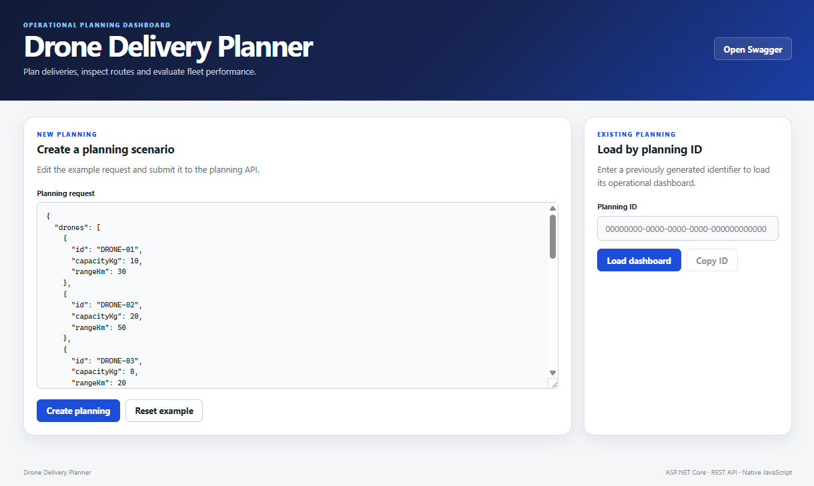
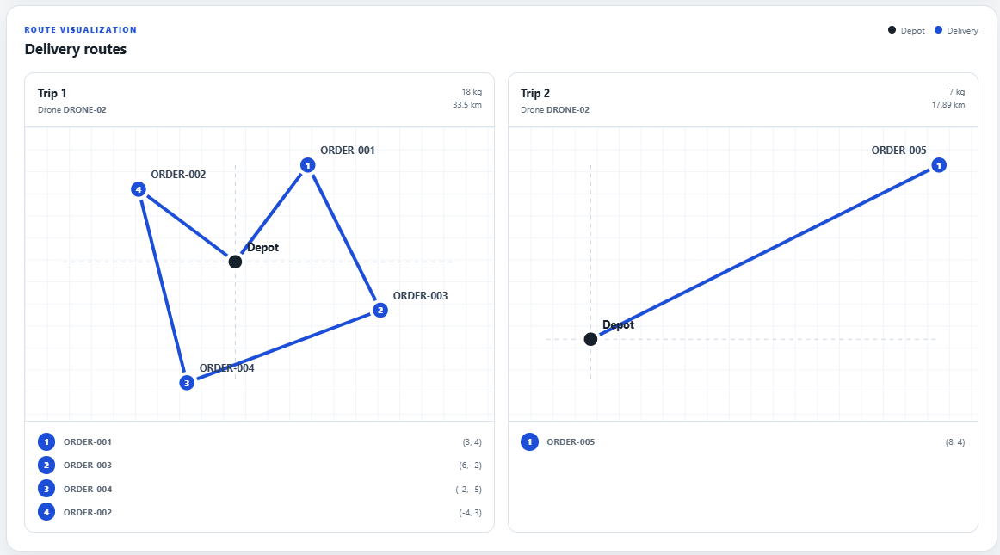
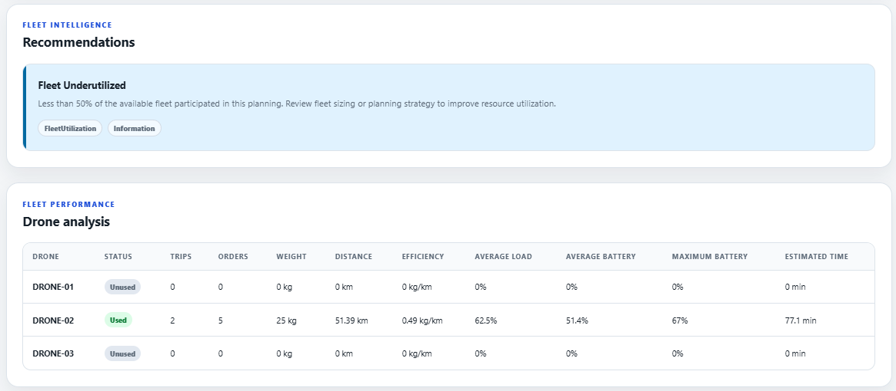
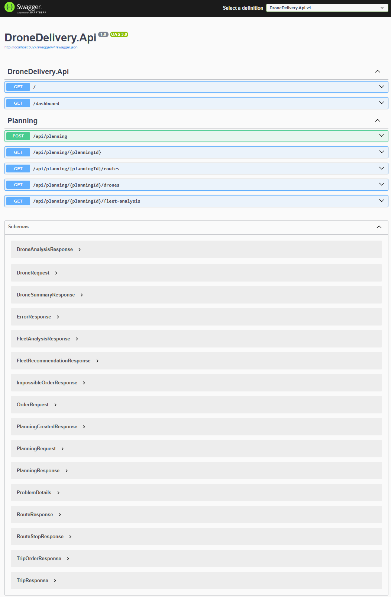
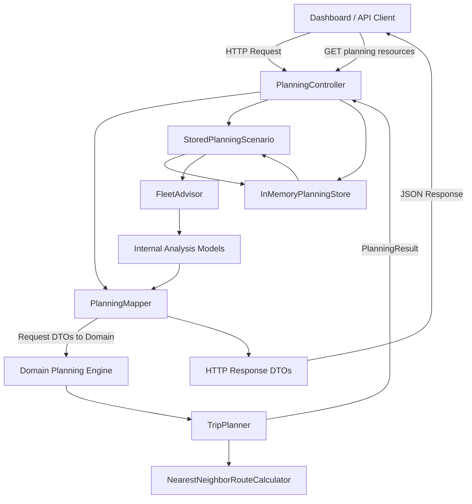
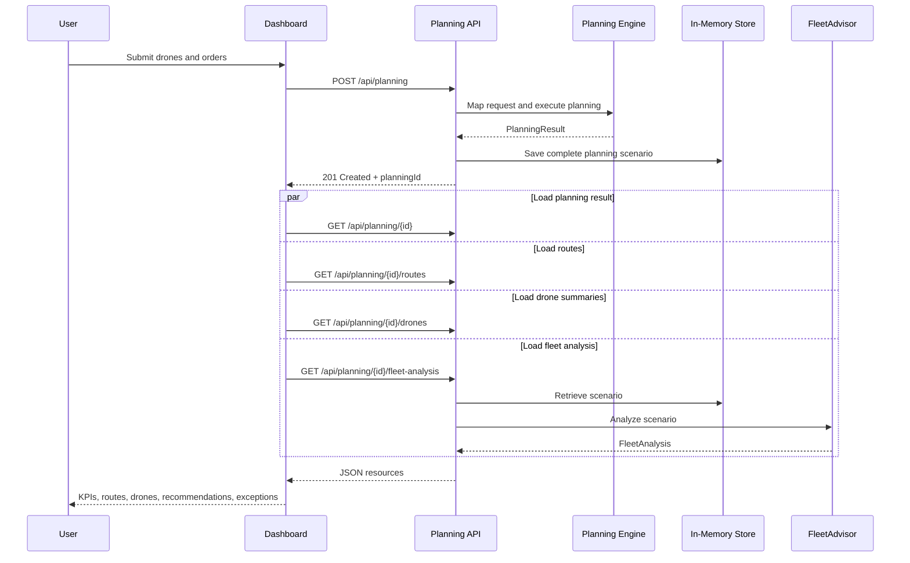

# Drone Delivery Planner

[](https://dotnet.microsoft.com/)
[](https://learn.microsoft.com/aspnet/core/)
[](#testing)
[](#license)
[](#)

🌐 **Languages:** 🇺🇸 English | 🇧🇷 [Português](LEIAME.md)

A full-stack drone delivery planning application built with **ASP.NET Core 8**, a domain-focused planning engine, in-memory scenario storage, fleet analytics, REST endpoints, automated tests, and a responsive dashboard implemented with native HTML, CSS, JavaScript, and SVG.

The project demonstrates practical backend engineering, domain modeling, API design, algorithmic reasoning, architectural trade-offs, and the ability to turn a technical take-home assignment into a complete, recruiter-friendly software product.

---

## Table of Contents

- [Overview](#overview)
- [Key Features](#key-features)
- [Demo](#demo)
- [Solution Architecture](#solution-architecture)
- [Technology Stack](#technology-stack)
- [Project Structure](#project-structure)
- [Planning Algorithm](#planning-algorithm)
- [FleetAdvisor](#fleetadvisor)
- [Application Flow](#application-flow)
- [API Endpoints](#api-endpoints)
- [Request and Response Examples](#request-and-response-examples)
- [Dashboard](#dashboard)
- [Running Locally](#running-locally)
- [Testing](#testing)
- [Architectural Decisions and Trade-offs](#architectural-decisions-and-trade-offs)
- [Future Improvements](#future-improvements)
- [License](#license)

---

## Overview

Drone Delivery Planner receives a fleet of drones and a set of delivery orders, then produces an operational plan that assigns feasible orders to drones and groups them into trips.

Each order contains a unique identifier, package weight, delivery priority, and Cartesian coordinates. Each drone contains a unique identifier, maximum payload capacity, and operational range.

The application evaluates whether each order can be served, generates delivery trips, calculates route distances, exposes the result through a REST API, stores the planning scenario in memory, and provides additional fleet-level operational analysis.

The dashboard consumes the same public API endpoints and does not duplicate business logic in the browser.

---

## Key Features

- Delivery planning based on payload capacity and drone range
- Priority-aware order processing
- Nearest-neighbor route construction
- Detection of impossible orders
- In-memory planning scenario storage
- Retrieval of previously created planning scenarios
- Route projection with ordered stops and coordinates
- Per-drone operational summaries
- Fleet participation and utilization analysis
- Load factor and range usage calculations
- Fleet efficiency in kilograms per kilometer
- Estimated flight time
- Actionable operational recommendations
- Strong separation between internal analysis models and HTTP contracts
- Responsive dashboard with native SVG route visualization
- Automated domain and API integration tests
- Swagger/OpenAPI documentation
- No frontend framework or external charting library required

---

---
## Demo

## Dashboard



## Routes



## Recommendations



## Swagger



---

## Solution Architecture

The solution separates the domain model, HTTP API, analytics, storage, mapping, and automated tests.



### Main responsibilities

| Component | Responsibility |
|---|---|
| `DroneDelivery.Domain` | Core entities, value objects, planning rules, routing logic, and planning results |
| `DroneDelivery.Api` | HTTP contracts, controllers, mapping, storage, analysis, configuration, and dashboard |
| `InMemoryPlanningStore` | Thread-safe storage of complete planning scenarios |
| `FleetAdvisor` | Operational fleet metrics and recommendations |
| `PlanningMapper` | Conversion between API contracts, domain objects, and response models |
| `DroneDelivery.Domain.Tests` | Unit tests for domain behavior |
| `DroneDelivery.Api.IntegrationTests` | End-to-end API behavior and contract validation |

---

## Technology Stack

### Backend

- .NET 8
- ASP.NET Core Web API
- C#
- Swagger / OpenAPI
- `ConcurrentDictionary`
- Options pattern with `IOptions<T>`

### Frontend

- HTML5
- CSS3
- Native JavaScript
- SVG
- Fetch API

### Testing

- xUnit
- `WebApplicationFactory<Program>`
- ASP.NET Core integration testing
- `System.Net.Http.Json`

### Engineering principles

- Domain-oriented design
- RESTful resource modeling
- Separation of concerns
- Explicit mapping between layers
- Type-safe internal models
- Thin controllers
- Testable business logic
- Framework-independent frontend

---

## Project Structure

```text
DroneDeliveryCase/
├── src/
│   ├── DroneDelivery.Domain/
│   │   ├── Entities/
│   │   ├── Enums/
│   │   ├── Services/
│   │   ├── ValueObjects/
│   │   └── ...
│   │
│   └── DroneDelivery.Api/
│       ├── Analysis/
│       │   ├── FleetAdvisor.cs
│       │   ├── RecommendationSeverity.cs
│       │   └── RecommendationType.cs
│       ├── Configuration/
│       │   └── FleetAnalysisOptions.cs
│       ├── Contracts/
│       │   ├── Requests/
│       │   └── Responses/
│       ├── Controllers/
│       │   └── PlanningController.cs
│       ├── Mapping/
│       │   └── PlanningMapper.cs
│       ├── Models/
│       │   ├── DroneAnalysis.cs
│       │   ├── FleetAnalysis.cs
│       │   └── FleetRecommendation.cs
│       ├── Storage/
│       │   ├── InMemoryPlanningStore.cs
│       │   └── StoredPlanningScenario.cs
│       ├── wwwroot/
│       │   └── dashboard/
│       │       ├── index.html
│       │       ├── dashboard.css
│       │       └── dashboard.js
│       ├── Program.cs
│       └── appsettings.json
├── tests/
│   ├── DroneDelivery.Domain.Tests/
│   └── DroneDelivery.Api.IntegrationTests/
├── README.md
└── LICENSE
```

---

## Planning Algorithm

The planning process determines which orders can be assigned to which drones and how deliveries are grouped into trips.

### 1. Request mapping

The API maps request DTOs into domain objects:

```text
DroneRequest -> Drone
OrderRequest -> Order
```

Domain objects preserve their original input order through an index, enabling deterministic behavior when equivalent values occur.

### 2. Order prioritization

Orders are processed by priority:

```text
High -> Medium -> Low
```

Original input order acts as a tie-breaker.

### 3. Feasibility validation

Before assignment, the planner verifies whether at least one drone can satisfy:

- the package payload requirement;
- the minimum distance required to leave the depot, reach the order, and return.

Orders that cannot be served are recorded with reasons such as:

```text
WeightExceeded
RangeExceeded
```

### 4. Trip assignment

Feasible orders are grouped into trips while respecting the selected drone's payload capacity and operational range.

### 5. Route calculation

The route calculator uses a nearest-neighbor heuristic. Starting at the depot `(0, 0)`, it repeatedly selects the nearest unvisited order and returns to the depot after the final stop.

```text
Depot
  -> nearest unvisited order
  -> next nearest unvisited order
  -> ...
  -> Depot
```

The route distance is the sum of Euclidean distances between consecutive points:

```text
distance = sqrt((x2 - x1)^2 + (y2 - y1)^2)
```

### Complexity

For a trip with `n` orders, route construction is approximately:

```text
O(n²)
```

The heuristic is deterministic, dependency-free, and appropriate for the scope of the case, although it does not guarantee the globally shortest route.

---

## FleetAdvisor

`FleetAdvisor` transforms a stored planning scenario into operational intelligence.

```text
StoredPlanningScenario
        ↓
FleetAdvisor
        ↓
FleetAnalysis
        ↓
PlanningMapper
        ↓
FleetAnalysisResponse
```

The analysis layer returns internal models rather than HTTP DTOs, keeping it independent from the transport layer.

### Metrics

#### Fleet participation

```text
used drones / total drones * 100
```

#### Average load factor

```text
trip weight / drone capacity * 100
```

#### Fleet efficiency

```text
total delivered weight / total distance
```

Unit:

```text
kg/km
```

#### Range usage

```text
trip distance / drone range * 100
```

Both average and maximum usage are reported per drone.

#### Estimated time

```text
distance / configured speed * 60
```

Default speed:

```text
40 km/h
```

### Recommendations

Recommendations separate category from severity:

```text
Type     -> recommendation category
Severity -> operational importance
```

Example:

```json
{
  "type": "ImpossibleOrders",
  "severity": "Critical",
  "title": "Impossible Orders Detected",
  "description": "Some orders could not be assigned because the current fleet does not satisfy the required payload or operational range."
}
```

Internal enums:

```csharp
public enum RecommendationType
{
    FleetUtilization,
    Capacity,
    Range,
    ImpossibleOrders,
    Performance
}
```

```csharp
public enum RecommendationSeverity
{
    Success,
    Information,
    Warning,
    Critical
}
```

The mapper converts these enums to strings at the API boundary.

### Configuration

```json
{
  "FleetAnalysis": {
    "DroneSpeedKmPerHour": 40,
    "UnderutilizedFleetThresholdPercentage": 50,
    "HighAverageLoadThresholdPercentage": 85,
    "HighRangeUsageThresholdPercentage": 90
  }
}
```

---

## Application Flow



---

## API Endpoints

Base resource:

```text
/api/planning
```

| Method | Endpoint | Description | Success |
|---|---|---|---|
| `POST` | `/api/planning` | Creates and stores a planning scenario | `201 Created` |
| `GET` | `/api/planning/{planningId}` | Returns the planning result | `200 OK` |
| `GET` | `/api/planning/{planningId}/routes` | Returns route projections and ordered stops | `200 OK` |
| `GET` | `/api/planning/{planningId}/drones` | Returns operational summaries for all drones | `200 OK` |
| `GET` | `/api/planning/{planningId}/fleet-analysis` | Returns fleet metrics and recommendations | `200 OK` |

Unknown planning identifiers return:

```text
404 Not Found
```

Swagger is available at:

```text
/swagger
```

---

## Request and Response Examples

### Create a planning scenario

```http
POST /api/planning
Content-Type: application/json
```

```json
{
  "drones": [
    {
      "id": "DRONE-01",
      "capacityKg": 10,
      "rangeKm": 30
    },
    {
      "id": "DRONE-02",
      "capacityKg": 20,
      "rangeKm": 50
    }
  ],
  "orders": [
    {
      "id": "ORDER-001",
      "weightKg": 4,
      "priority": "High",
      "x": 3,
      "y": 4
    },
    {
      "id": "ORDER-002",
      "weightKg": 6,
      "priority": "Medium",
      "x": -4,
      "y": 3
    }
  ]
}
```

Example response:

```http
HTTP/1.1 201 Created
Location: /api/planning/105307b6-d401-4b9c-b153-57b454c14aea
```

```json
{
  "planningId": "105307b6-d401-4b9c-b153-57b454c14aea",
  "createdAtUtc": "2026-07-20T12:10:00Z",
  "planning": {
    "trips": [
      {
        "droneId": "DRONE-02",
        "orders": [
          {
            "id": "ORDER-001",
            "sequence": 1
          },
          {
            "id": "ORDER-002",
            "sequence": 2
          }
        ],
        "totalWeightKg": 10,
        "totalDistanceKm": 15
      }
    ],
    "impossibleOrders": []
  }
}
```

### Get route details

```http
GET /api/planning/{planningId}/routes
```

```json
[
  {
    "tripSequence": 1,
    "droneId": "DRONE-02",
    "totalWeightKg": 4,
    "totalDistanceKm": 10,
    "stops": [
      {
        "sequence": 1,
        "orderId": "ORDER-001",
        "x": 3,
        "y": 4
      }
    ]
  }
]
```

### Get drone summaries

```http
GET /api/planning/{planningId}/drones
```

```json
[
  {
    "droneId": "DRONE-01",
    "capacityKg": 10,
    "rangeKm": 30,
    "wasUsed": false,
    "tripCount": 0,
    "deliveredOrders": 0,
    "totalDeliveredWeightKg": 0,
    "totalDistanceKm": 0
  },
  {
    "droneId": "DRONE-02",
    "capacityKg": 20,
    "rangeKm": 50,
    "wasUsed": true,
    "tripCount": 1,
    "deliveredOrders": 1,
    "totalDeliveredWeightKg": 4,
    "totalDistanceKm": 10
  }
]
```

### Get fleet analysis

```http
GET /api/planning/{planningId}/fleet-analysis
```

```json
{
  "totalDrones": 2,
  "usedDrones": 1,
  "totalTrips": 1,
  "deliveredOrders": 1,
  "impossibleOrders": 0,
  "totalDeliveredWeightKg": 4,
  "totalDistanceKm": 10,
  "fleetParticipationPercentage": 50,
  "averageLoadFactorPercentage": 20,
  "fleetEfficiencyKgPerKm": 0.4,
  "estimatedTotalTimeMinutes": 15,
  "drones": [
    {
      "droneId": "DRONE-02",
      "wasUsed": true,
      "tripCount": 1,
      "deliveredOrders": 1,
      "deliveredWeightKg": 4,
      "distanceKm": 10,
      "efficiencyKgPerKm": 0.4,
      "averageLoadFactorPercentage": 20,
      "averageBatteryUsagePerTripPercentage": 20,
      "maximumBatteryUsagePerTripPercentage": 20,
      "estimatedTimeMinutes": 15
    }
  ],
  "recommendations": [
    {
      "type": "Performance",
      "severity": "Success",
      "title": "Fleet Well Balanced",
      "description": "The planning completed successfully without identifying capacity, range or utilization concerns.",
      "suggestedMinimumCapacityKg": null,
      "suggestedMinimumRangeKm": null
    }
  ]
}
```

### Impossible order example

```json
{
  "id": "ORDER-HEAVY",
  "weightKg": 100,
  "priority": "High",
  "x": 2,
  "y": 2
}
```

```json
{
  "impossibleOrders": [
    {
      "orderId": "ORDER-HEAVY",
      "reason": "WeightExceeded"
    }
  ]
}
```

---

## Dashboard

The dashboard is served directly by the ASP.NET Core application:

```text
/dashboard
```

It provides:

- a JSON editor for planning requests;
- creation of planning scenarios;
- loading by `planningId`;
- shareable URL parameters;
- KPI cards;
- fleet recommendations;
- drone performance tables;
- native SVG route maps;
- impossible-order highlighting;
- loading and error states;
- responsive design.

After creating or loading a planning scenario, the dashboard requests all resources in parallel:

```javascript
await Promise.all([
    fetch(`/api/planning/${planningId}`),
    fetch(`/api/planning/${planningId}/routes`),
    fetch(`/api/planning/${planningId}/drones`),
    fetch(`/api/planning/${planningId}/fleet-analysis`)
]);
```

All calculations remain in the backend. The browser only renders API data.

---

## Running Locally

### Prerequisites

- .NET 8 SDK
- Git
- A modern web browser

### Clone the repository

```bash
git clone https://github.com/Lucas-aos/DroneDeliveryCase.git
cd DroneDeliveryCase
```

### Restore and build

```bash
dotnet restore
dotnet build
```

### Run the API

```bash
dotnet run --project src/DroneDelivery.Api
```

Open:

```text
https://localhost:<port>/dashboard
```

Swagger:

```text
https://localhost:<port>/swagger
```

---

## Testing

Run all tests:

```bash
dotnet test
```

Run domain tests:

```bash
dotnet test tests/DroneDelivery.Domain.Tests
```

Run API integration tests:

```bash
dotnet test tests/DroneDelivery.Api.IntegrationTests
```

Run with detailed output:

```bash
dotnet test --logger "console;verbosity=detailed"
```

The automated suite validates:

- valid planning creation;
- invalid priority;
- invalid package weight;
- impossible orders;
- retrieval by planning ID;
- unknown planning IDs;
- route projection;
- drone summaries;
- fleet analysis;
- per-drone metrics;
- minimum capacity and range recommendations;
- HTTP status codes and response contracts.

---

## Architectural Decisions and Trade-offs

### In-memory storage

The application uses a thread-safe `ConcurrentDictionary<Guid, StoredPlanningScenario>`.

**Benefits**

- keeps the case focused on domain logic and API design;
- removes database setup friction;
- enables immediate local execution.

**Trade-off**

Planning data is lost when the application restarts and cannot be shared across multiple instances.

### Complete scenario storage

The store preserves:

```text
PlanningId
CreatedAtUtc
Original drones
Original orders
PlanningResult
```

This supports analytics, route visualization, summaries, and future endpoints without reconstructing the original request.

### Internal analysis models

`FleetAdvisor` returns internal models instead of API response DTOs.

This avoids coupling the analysis layer to HTTP and keeps the public contract explicit.

### Enums internally, strings externally

Recommendation type and severity use enums inside the application and strings at the API boundary.

This combines compile-time safety with readable JSON.

### Nearest-neighbor routing

The route calculator uses a nearest-neighbor heuristic.

**Benefits**

- deterministic;
- understandable;
- dependency-free;
- suitable for the case.

**Trade-off**

It does not guarantee the globally shortest route.

### Native frontend

The dashboard uses HTML, CSS, JavaScript, and SVG without a frontend framework.

**Benefits**

- no frontend build pipeline;
- low dependency count;
- direct REST integration;
- simple deployment.

**Trade-off**

A larger interface would eventually benefit from component-based state management.

### Thin controllers

Controllers coordinate application flow but do not contain planning or analytical rules.

This improves maintainability and testability.

### Explicit mapping

The project uses `PlanningMapper` rather than an object-mapping library.

**Benefits**

- mapping remains visible;
- no reflection-based configuration;
- domain entities are not accidentally exposed.

**Trade-off**

Manual mapping adds code as contracts grow.

---

## Future Improvements

- PostgreSQL or SQL Server persistence
- Entity Framework Core
- Planning history and pagination
- Authentication and authorization
- Multi-user workspaces
- Distributed caching
- Route optimization with 2-opt, 3-opt, or exact solvers
- Charging time and battery reserve rules
- Weather and no-fly-zone constraints
- Delivery time windows
- Drone availability schedules
- Live telemetry
- Geographic map support
- SignalR updates
- CSV and Excel export
- Docker support
- GitHub Actions CI/CD
- Test coverage reporting
- Structured logging
- Health checks
- OpenTelemetry
- API versioning
- Rate limiting
- Cloud deployment

---

## License

This project is licensed under the MIT License.

---

## Development History

This project was developed incrementally, with technical decisions, validations, tests, and architectural trade-offs documented throughout the development process.

- [View the AI-assisted development history](https://chatgpt.com/share/6a5e196f-dc94-83e9-8848-0a7b4b97055d)

---

## Author

Developed as a software engineering portfolio project focused on:

- backend development;
- ASP.NET Core;
- REST API design;
- domain modeling;
- algorithms;
- automated testing;
- architecture;
- operational dashboards.
