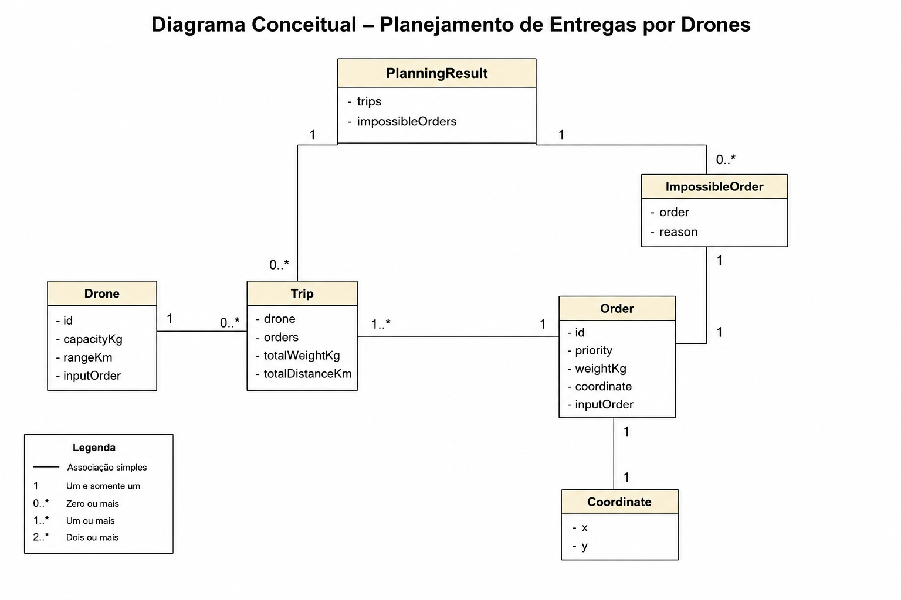

# Modelo conceitual do domínio

## Diagrama conceitual

## 1. Objetivo da modelagem

Este modelo representa os conceitos necessários para descrever o planejamento de entregas por drones e o resultado produzido por esse planejamento.

Seu foco é o domínio: drones, pedidos, coordenadas, viagens e pedidos impossíveis. Banco de dados, API, interface gráfica e infraestrutura não fazem parte deste documento.

A principal finalidade do modelo é separar claramente:

- os dados de entrada do planejamento;
- os resultados produzidos;
- as relações entre esses elementos.

Essa separação reduz ambiguidades antes da implementação e permite validar se o código representará corretamente as regras de negócio já consolidadas.

---

## 2. Visão geral do domínio

Um `Order` representa uma entrega solicitada e possui prioridade, peso e destino. O destino é representado por `Coordinate`.

Um `Drone` representa o recurso capaz de executar entregas, limitado por capacidade e alcance.

Quando pedidos são agrupados para um drone, o resultado é representado por `Trip`, que registra o drone utilizado, os pedidos incluídos e os valores consolidados de peso e distância.

Pedidos que não podem ser atendidos são representados por `ImpossibleOrder`, preservando o pedido original e acrescentando o motivo da impossibilidade.

Por fim, `PlanningResult` reúne todas as viagens e todos os pedidos impossíveis, oferecendo uma visão completa do resultado do planejamento.

---

## 3. Classes do modelo

### 3.1. `Drone`

#### Responsabilidade

Representar um drone disponível para o planejamento.

#### Principais atributos

- `Capacity`: capacidade máxima de carga.
- `Range`: alcance máximo.

#### Por que essa classe existe

Capacidade e alcance pertencem ao mesmo conceito: o recurso físico utilizado nas entregas. Mantê-los em `Drone` permite que as viagens façam referência ao equipamento selecionado sem duplicar seus dados.

#### O que não é responsabilidade da classe

`Drone` não seleciona pedidos, não calcula rotas e não decide quando será utilizado. Essas decisões pertencem ao processo de planejamento, não ao recurso representado.

---

### 3.2. `Order`

#### Responsabilidade

Representar um pedido individual de entrega.

#### Principais atributos

- `Priority`: prioridade do pedido.
- `Weight`: peso do pedido.
- `Coordinate`: destino da entrega.

#### Por que essa classe existe

O pedido é a unidade central do planejamento. Suas características determinam como ele pode ser classificado, agrupado e transportado.

Manter esses dados em um único objeto evita que prioridade, peso e destino sejam tratados separadamente durante o algoritmo.

#### O que não é responsabilidade da classe

`Order` não escolhe o drone, não decide em qual viagem será incluído e não determina sozinho se é impossível.

---

### 3.3. `Coordinate`

#### Responsabilidade

Representar uma posição no plano cartesiano por meio de `X` e `Y`.

#### Principais atributos

- `X`
- `Y`

#### Por que essa classe existe

Criar `Coordinate` evita armazenar `X` e `Y` diretamente em `Order` e torna o conceito de posição reutilizável e explícito.

Essa decisão melhora a coesão: `Order` descreve o pedido, enquanto `Coordinate` descreve apenas sua localização. Também facilita o uso do mesmo conceito para a base e para outros pontos da rota sem duplicar estrutura.

#### O que não é responsabilidade da classe

`Coordinate` não conhece prioridades, pedidos ou drones e não decide a ordem de visita.

---

### 3.4. `Trip`

#### Responsabilidade

Representar uma viagem planejada para um drone.

#### Principais atributos

- `Drone`: drone responsável.
- `Orders`: pedidos incluídos.
- `TotalWeight`: peso consolidado da viagem.
- `TotalDistance`: distância consolidada da viagem.

#### Por que essa classe existe

Uma viagem é mais do que uma lista de pedidos: ela registra qual drone será utilizado e os resultados calculados para aquele agrupamento.

`TotalWeight` e `TotalDistance` permanecem em `Trip` porque são propriedades do resultado da viagem. Mantê-los consolidados evita que consumidores do modelo precisem recalcular essas informações sempre que consultarem o planejamento.

#### O que não é responsabilidade da classe

`Trip` não seleciona o drone, não procura candidatos e não coordena a criação das viagens seguintes. Ela representa uma viagem formada pelo processo de planejamento.

---

### 3.5. `ImpossibleOrder`

#### Responsabilidade

Representar um pedido que não pode ser atendido e registrar o motivo correspondente.

#### Principais atributos

- `Order`: pedido original.
- `Reason`: motivo da impossibilidade.

#### Por que essa classe existe

O motivo da impossibilidade não é uma característica permanente de `Order`. Ele surge como resultado da análise feita pelo planejamento.

Adicionar `Reason` diretamente em `Order` misturaria o pedido original com um estado produzido posteriormente e obrigaria pedidos atendíveis a carregar uma informação sem utilidade.

`ImpossibleOrder` preserva `Order` sem alterações e acrescenta apenas o contexto necessário para explicar por que ele não foi planejado.

#### O que não é responsabilidade da classe

`ImpossibleOrder` não executa a análise de viabilidade. Ele registra o resultado dessa análise.

---

### 3.6. `PlanningResult`

#### Responsabilidade

Representar o resultado completo do planejamento.

#### Principais atributos

- `Trips`: viagens planejadas.
- `ImpossibleOrders`: pedidos não atendíveis e seus motivos.

#### Por que essa classe existe

O planejamento pode produzir simultaneamente viagens válidas e pedidos impossíveis. Retornar apenas as viagens ocultaria parte relevante do resultado.

`PlanningResult` cria um único ponto de acesso para os dois resultados possíveis do processo:

- pedidos atribuídos a viagens;
- pedidos classificados como impossíveis.

Essa agregação facilita validar, apresentar e consumir o resultado sem misturar responsabilidades em `Trip` ou `Order`.

#### O que não é responsabilidade da classe

`PlanningResult` não executa o algoritmo. Ele apenas consolida o que foi produzido.

---

## 4. Componentes de comportamento

Este diagrama concentra-se exclusivamente nos objetos do domínio e em seus relacionamentos.

Os componentes responsáveis pela execução do algoritmo — como `TripPlanner`, `DistanceCalculator` e `NearestNeighborRouteCalculator` — serão documentados durante a etapa de implementação, preservando a separação entre representação do domínio e comportamento da aplicação.

---

## 5. Relacionamentos entre os objetos

### `Order` e `Coordinate`

Um `Order` referencia uma `Coordinate` para representar seu destino.

A separação permite que localização seja tratada como um conceito próprio, sem espalhar `X` e `Y` por classes que possuem outras responsabilidades.

### `ImpossibleOrder` e `Order`

Um `ImpossibleOrder` referencia o `Order` original e acrescenta `Reason`.

Essa relação preserva os dados originais do pedido e separa o pedido recebido do resultado de sua avaliação.

### `Trip` e `Drone`

Uma `Trip` referencia o `Drone` selecionado.

Isso identifica qual recurso executará a viagem sem exigir que `Drone` mantenha ou controle uma coleção de viagens.

### `Trip` e `Order`

Uma `Trip` contém vários `Orders`.

Esse relacionamento representa o agrupamento de pedidos em uma única viagem e permite registrar os totais consolidados daquele conjunto.

### `PlanningResult` e `Trip`

`PlanningResult` agrega as `Trips` produzidas pelo planejamento.

O resultado pode conter várias viagens porque um mesmo planejamento pode exigir múltiplas execuções de entrega.

### `PlanningResult` e `ImpossibleOrder`

`PlanningResult` também agrega `ImpossibleOrders`.

A separação entre viagens e impossibilidades torna explícito que todos os pedidos precisam aparecer em algum resultado do planejamento.

---

## 6. Decisões de modelagem inferidas do diagrama

### Separação entre entrada e resultado

`Order` representa o pedido recebido. `Trip` e `ImpossibleOrder` representam resultados produzidos a partir dele.

Essa separação evita modificar o pedido original para registrar decisões do algoritmo.

### `Coordinate` como conceito próprio

A localização foi isolada porque possui significado independente do pedido e pode ser usada em qualquer contexto que represente um ponto no plano cartesiano.

### `Trip` como resultado consolidado

A viagem mantém o drone, os pedidos e os totais relevantes. Isso permite compreender uma viagem sem reconstruir seu estado a partir de dados dispersos.

### `PlanningResult` como fronteira do resultado

O objeto reúne tudo o que o planejamento produz. Ele impede que o consumidor precise combinar listas independentes ou inferir quais pedidos ficaram sem atendimento.

### Ausência de infraestrutura

O modelo não contém elementos de banco de dados, API ou interface porque esses elementos não pertencem ao problema de negócio representado.

### Ausência do algoritmo no diagrama

O diagrama descreve o que existe no domínio e o que é produzido. Ele não determina como o algoritmo será organizado internamente.

---

## 7. Próximos passos da implementação

1. Definir os tipos concretos de capacidade, alcance, peso, distância, coordenadas, prioridade e motivo de impossibilidade.
2. Definir as validações mínimas necessárias para impedir objetos inválidos.
3. Determinar como as coleções de pedidos, viagens e pedidos impossíveis serão expostas e protegidas contra alterações indevidas.
4. Implementar o comportamento que transforma drones e pedidos em `PlanningResult`.
5. Confirmar se `Orders` em `Trip` preservará diretamente a ordem de visita definida pelo planejamento.
6. Validar a implementação com os cenários já registrados em `spec-validation.md`.

Essas decisões devem transformar o modelo em código sem alterar sua estrutura conceitual nem as regras de negócio congeladas.

---

## Pontos que o autor deve compreender

Antes de considerar este documento finalizado, o autor deve ser capaz de explicar:

1. Por que `Drone`, `Order`, `Coordinate`, `Trip`, `ImpossibleOrder` e `PlanningResult` representam responsabilidades diferentes.
2. Por que `Coordinate` existe em vez de manter `X` e `Y` diretamente em `Order`.
3. Por que `Order` representa a entrada do domínio e não deve carregar decisões do planejamento.
4. Por que `ImpossibleOrder` referencia um `Order` e mantém `Reason` separadamente.
5. Por que `Trip` referencia o drone e agrupa os pedidos planejados.
6. Por que `TotalWeight` e `TotalDistance` são valores consolidados da viagem.
7. Por que `PlanningResult` agrega tanto `Trips` quanto `ImpossibleOrders`.
8. A diferença entre classes que representam dados e resultados e componentes que executam o algoritmo.
9. Por que `Drone` e `Trip` não devem coordenar o planejamento completo.
10. Por que o modelo não inclui banco de dados, API ou infraestrutura.
11. Quais tipos, validações e regras de mutabilidade ainda precisam ser definidos na implementação.
12. Como os cenários de `spec-validation.md` confirmarão que o código preserva o modelo e as regras congeladas.